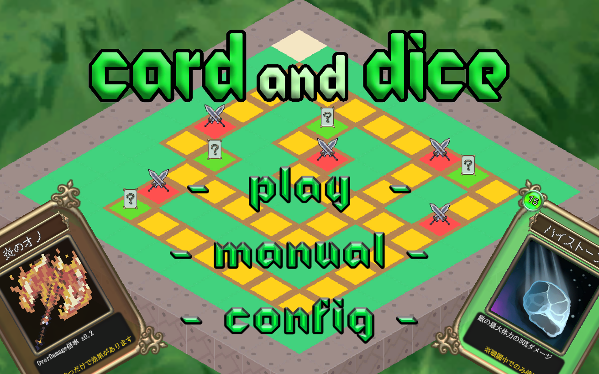
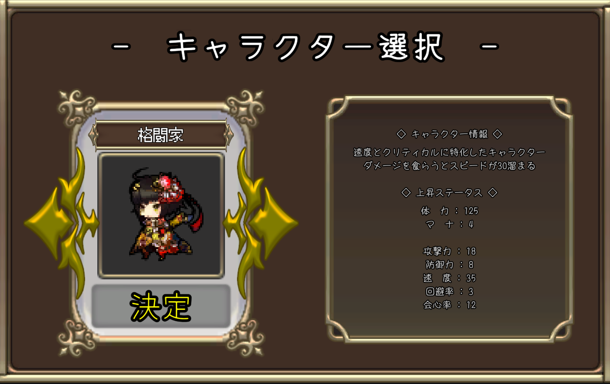
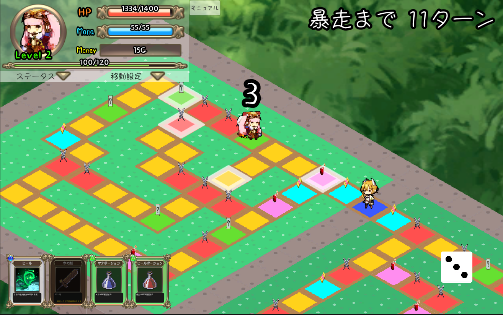

# CardAndDice
## 概要 
>ジャンル: ローグライク  
>制作人数: 1人 
>製作期間: 2ヶ月 
>制作時期: 2年次 
>開発環境: 
>>エンジン: Unity 
>>言語: C# 
>>ツール: Paint.net Excel 
>>使用アセット: DoTween, Unity Excel Importer Maker 
>実行環境: 
>>OS: Windows 10 
>>RAM: 8GB 
>>GPU: Intel i5-8250U   

 

## ゲーム内容 
双六のようにサイコロを振ってどんどん進んでいき、戦闘やカードマスやショップなどのイベントマスを
踏んでいき、カードを集めてデッキを完成させてきならが、7体のボスを全員倒すといったゲーム。
ボスたちはそれぞれのエリアごとに存在しており、15ターン以内に挑まないと敵の全ステータスが強化
されてしまう。そしてデッキを組む上で大事なのはカードには魔法、道具、装備の3種類が存在しており、
魔法はManaを消費して使うカード、道具は一定ターン後に再利用できるカード、装備は所持しているだけで
ステータスが上がるカード、これらを職業の性質に合わせて組み合わせることが大事である。 

 
[WebGL版のゲームを実行](https://saradabapepe.github.io/WebGL_CardAndDice/)
 

## 開発目的 
学校の行事の一つである展示会等も近かったので、それに向けた制作である。
展示会で出される作品はフラッシュゲームのような簡易なゲームが多いので、
もっと見てもらう人に長く沢山遊べるようなゲームを作りたいと考えて、このゲームを制作した。
そしてこの制作でマップの動的生成や、経路探索、カード管理などの様々な知識を得ることが出来た。
結果として、展示会ではクラス内で2位の評価を受けることが出来ました。 

 

## 頑張った点 
-複数の特殊能力を持った職業 
-形は決まっているが、イベントの配置がランダムに置かれる自動生成 
	-マップの形は実行時に読み込むので、Unity標準のTilemapで簡単に変更できるように 
-複数のカードを管理出来るエディター 
-2種類の移動方法 
	-分岐ごとに移動方向を指定する方法 
	-移動先を指定する方法 
-フェードの演出 

 

## スクリーンショット 
[紹介動画 - Youtube](https://www.youtube.com/watch?v=WkhDCEypmUI) 

